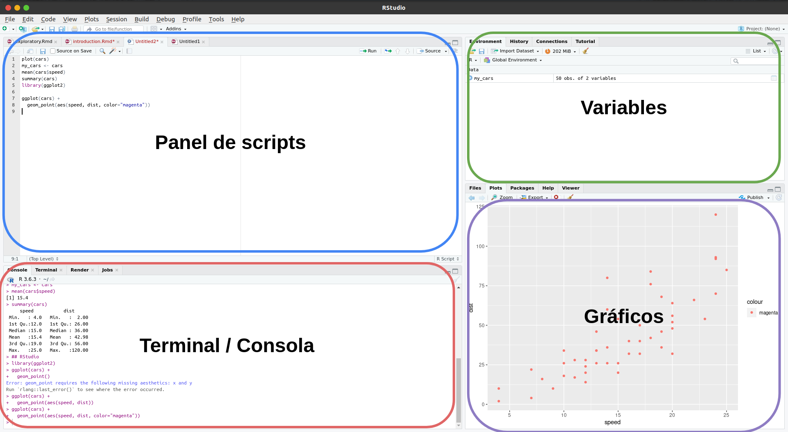

```{r setup, include=FALSE}
knitr::opts_chunk$set(echo = FALSE)
```

## ¿Qué es R?


R es un lenguaje de programación libre enfocado a la **computación estadistica y gráfica**. 

Posee una amplia variedad de herramientas que facilitan la manipulacion de datos, realización de calculos y la visualización de graficos intuitivos y poderosos. 

En la actualidad R es uno de los lenguajes de programación **más requeridos en trabajos de Data Science**.

<p align="center">

</p>

<font size="1" style="margin-left: 60px"> **Fuente:** 9 Top Programming Languages for Data Science. Edx. Accessed at: https://blog.edx.org/9-top-programming-languages-for-data-science</font>

---

### **Principales Características**

- R es gratis y de código abierto
- Se ejecuta en las principales plataformas: Windows, Mac OS, UNIX/Linux
- Existe una grande, activa, y en constante crecimiento comunidad de usuarios de R, así que existe una gran cantidad de recursos para aprender y hacer preguntas
- Es fácil de contribuir con nuevos *add-ons* que permite a los desarrolladores compatir implementaciones de nuevas metodologías de ciencia de datos


**Recursos:**

- [Introduction to Data Science](https://rafalab.github.io/dsbook/getting-started.html)
- [RMarkdown Cookbook](https://bookdown.org/yihui/rmarkdown/)
- [R for Data Science](https://r4ds.had.co.nz/explore-intro.html)


## ¿Como se instala?

Puedes seguir las instrucciones de instalación para su sistema operativo en el siguiente enlace [https://www.r-project.org/](https://www.r-project.org/).


Es recomendable usar Rstudio como IDE para trabajar en R. Puede descargarlo en el siguiente enlace [https://rstudio.com/](https://rstudio.com/).


## RStudio


{width=90%}


## Sintaxis básica {.faster .build}

### **Objetos**

> - Se usa `<-` para asignar valores a los objetos.

```{r echo=TRUE}
mi_variable <- "Bienvenidos al Taller de R"
```

> - Para consultar el valor de una variable bastará con escribir su nombre

```{r echo=TRUE}
mi_variable
```
> - Para eliminar una variable del ambiente de trabajo:

```{r echo=TRUE}
rm(mi_variable)
```


## {.faster .build}

### **Funciones**

Tambien podemos llamar a las diferentes funciones built-in de R


```{r echo=TRUE}
sqrt(2)
log(1000)
```

Si desconocemos que hace una función, podemos invocar a la ayuda

```{r echo=TRUE}
help("sqrt")
```

O de manera acortada:

```{r echo=TRUE}
?sqrt
```

## Tipos de datos {.build}

### Dataframe

Los `data.frame()` son estructuras análogas a las tablas, cuyas filas representan observaciones y las columnas a variables. Por ejemplo:

```{r echo=TRUE}
nombres <- c("Juan", "Maria", "Pepito")
distrito <- c("SJL", "SJM", "VES")
edad <- c(18, 17, 12)
mi_dataframe<-data.frame(nombres, distrito, edad)
```

Si queremos examinar la estructura de un dataframe

```{r echo=TRUE}
str(mi_dataframe)
```
## {.build}

O examinar los 6 primeros o últimos valores del dataframe

```{r echo=TRUE}
head(iris)
tail(iris)
```


## {.build}

Para acceder a los elementos de un dataframe

```{r echo=TRUE}

mi_dataframe$nombres
mi_dataframe["nombres"]
```

Para ver los nombres de las variables

```{r echo=TRUE}
names(mi_dataframe)
```

Para ver la cantidad de filas y columnas

```{r echo=TRUE}
ncol(mi_dataframe)
nrow(mi_dataframe)
dim(mi_dataframe)
```

## {.build}

### **Numéricos**

```{r echo=TRUE}
my_number <- 2
my_float <- 2.3
```

### **Caracteres**

```{r echo=TRUE}
my_var <- 'A'
my_var2 <- "IEEE-CS"
```

### **Lógicos**

```{r echo=TRUE}
my_bool <- T
my_bool2 <- TRUE
my_bool <- 3 == 2
```

## {.build}

### **Vectores**

- El comando `c()` se emplea para crear un vector de objetos separados por comas. Si los elementos son de diferentes tipos, se aplicará la coerción, que es combertir todos los elementos a un mismo tipo de datos.

```{r echo=TRUE}
mi_vector <- c(1, "a", 1.23, TRUE)
```


- Tambien puedes insertar una secuencia de numeros dentro de un vector

```{r echo=TRUE}
mi_secuencia <- c(0, 3:7, -1, 13)
```
- Puedes acceder al valor o una porcion de valores del vector usando sus índices

```{r echo=TRUE}
mi_secuencia[0] # los indices no inician en 0
mi_secuencia[1]
mi_secuencia[2:3]
```

## {.build}

### **Factores**

Son útiles para representar dats categóricos

```{r echo=TRUE}
levels(iris$Species)
```

### **Listas**

Los dataframes son un caso especial de listas. Las mistas son utiles para almacenar cualquier combinacion de tipos de datos diferentes.

```{r echo=TRUE}
record <- list(name = "John Nash",
             student_id = 1234,
             grades = c(95, 82, 91, 97, 93),
             final_grade = "A")
```


## {.build}

### **Matrices**

Son similares a los dataframes, a diferencia que en una matriz todos sus elementos deben ser del mismo tipo


```{r echo=TRUE}
mi_matriz <- matrix(1:20, 4, 5)
```
Para acceder a un elemento de la matriz deberemos usar sus índices: 
```{r echo=TRUE}
mi_matriz[2, 3]
```

Tambien podemos acceder a una fila o columna completa

```{r echo=TRUE}
mi_matriz[2, ]
mi_matriz[, 3]
```

## Cargar paquetes {.build}

Muchos de los paquetes communmente empleados ya vienen por defecto en la instalación de R. Sin embargo en algunas ocasiones tendremos que descargarlos previamente para poder usarlos. Para ello emplearemos el comando `install.packages()`. 

Por ejemplo si requerimos el paquete de visualización **ggplot2** escribiremos:

```{r echo=T, eval=F}
 install.packages(ggplot2)
```


Para usar un paquete en R bastará con usar el comando `library()` para cargarlo a nuestro entorno de trabajo. Por ejemplo, para el ejemplo anterior escribiremos:

```{r echo=T, eval=F}
library(ggplot2)
```

## Manejo de directorios

- `getwd()`: indica en que directorio estas
- `ls`: listar los archivos en el directorio
- `setwd()`: indica en que directorio quieres trabajar
- `rm`: elimina objetos del ambiente de trabajo
- `rm(archivo)`: elimina un archivo en particular

# Gracias